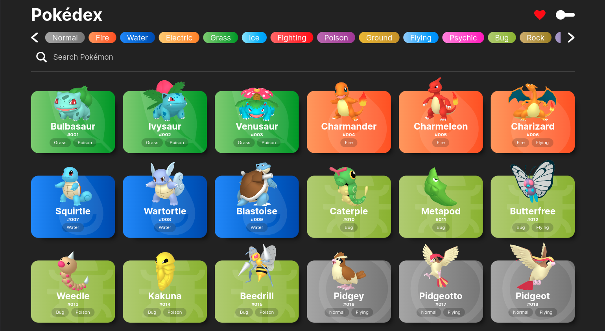
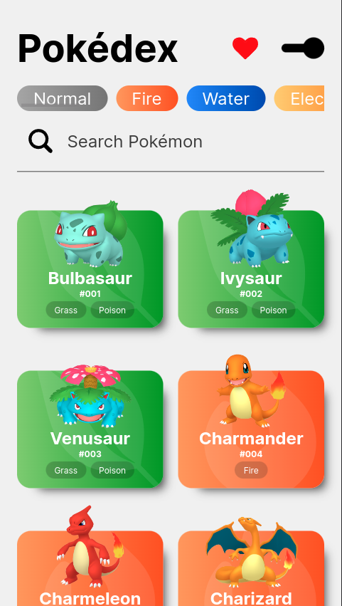
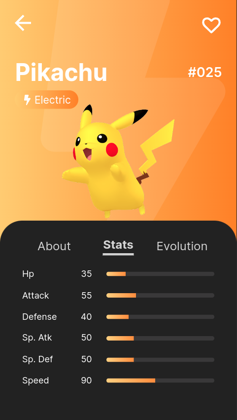

# Pokedex

  
  

## Sobre

  Pokédex construída com Vite e styled-components. 
  Além de uma página de favoritos, o projeto inclui 
  pesquisa por nome, id e tipo de cada pokémon disponível 
  na PokeAPI.

## Ferramentas

- JavaScript
- ReactJS
- Styled-components
- PokeAPI 

## Deploy

https://pokedex-iantavares1.vercel.app

## PokeAPI

https://pokeapi.co/

